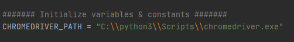
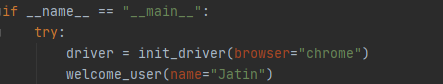
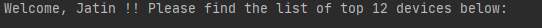
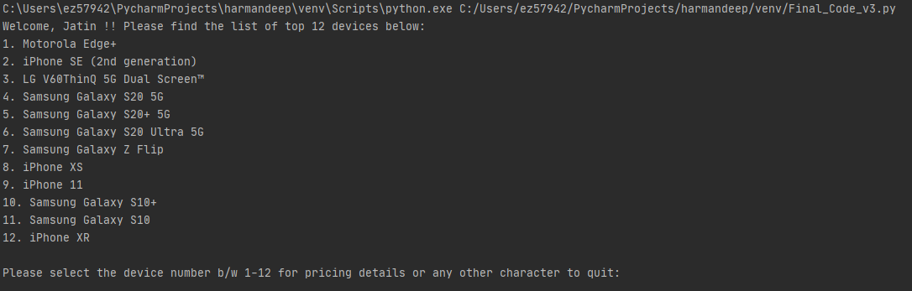
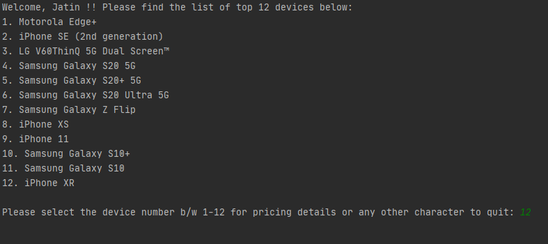
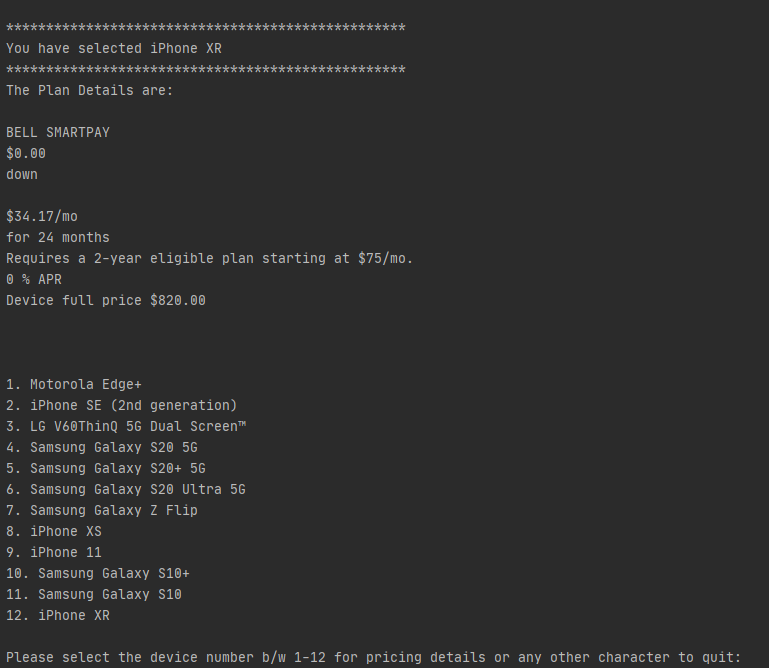
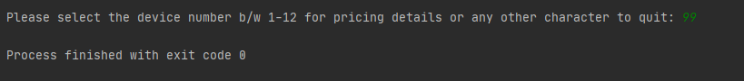

# Starting Price Lookup Tool
## Introduction: Top 12 Mobile Devices (CLI price plan lookup)
This program is intended to help the user in getting the list of top 12 mobile devices from [Bell Smartphone page](https://www.bell.ca/Mobility/Smartphones_and_mobile_internet_devices) and providing the user with an ability to fetch the price plans (Device Return/Smart Pay) for the selected device in a CLI (Command-line interface).

## Technologies used
Below is a list of technologies that were used:

- Programming Language: Python 3.8.3
-	Selenium WebDriver: 3.141.0
-	Chrome Driver 81.0.4044.138
-	IDE used : Pycharm
-	Supported OS: Windows/MacOS

## Getting Started / Illustrations

-	Setting the Path for the Chrome Driver 

-	 Setting the name of the user. 

-	When a user starts the program, the user will get a welcome message

-	The program will then go to the [Bell Smartphone page](https://www.bell.ca/Mobility/Smartphones_and_mobile_internet_devices) and retrieve the names of the top 12 devices

-	The program will then give the user a list of these 12 devices that the user can choose from.

-	 User will be able to select the associated device by entering/inputing any number from 1 to 12. 

-	When user selects the device (1-12) from the list, program will visit the same [webpage](https://www.bell.ca/Mobility/Smartphones_and_mobile_internet_devices) , click on the requested device and then it will get the price plans (Smart Pay/Device Return) for all terms listed with required conditions. Once the price is obtained, program will print the device's name, the prices, and their respective terms to the command-line.

 

-	Once the price of selected device is printed in the CLI then program will again print the list of top 12 devices in CLI. Now, user can again, input the device number (1-12) it should print the device's name, the prices and their respective terms to the command-line. 

-If user wants to exit the program, then user can type anything except numbers from 1-12. 

 
 
## Additional Information

Should you need any clarifications please contact me at  `harmandeep.singh3@bell.ca`.
